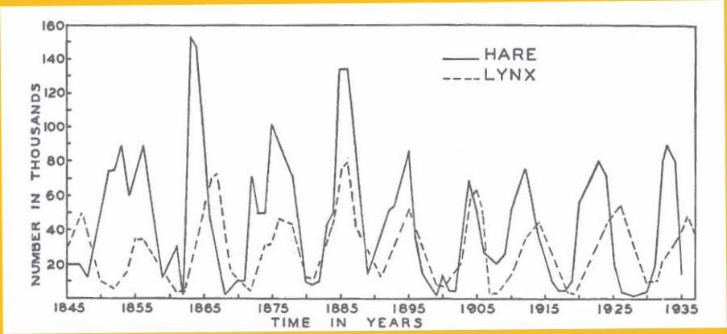

# ML-on-Graphs-Project

### Notes from the original source:

NOTE about the data: I have not been able to verify this data, but this is the data (or rather the graph) that is always cited. This particular set of data came from scanning in the graph from Odum's "Fundamentals of Ecology", p. 191 which is often cited. Odum says that his graph is taken from MacLulich's "Fluctuations in the numbers of varying hare", 1937, which is not widely available. Some authors caution that this data is actually a composition of several time series, and should probably not be analyzed as a whole, and that some of the lynx data was actually missing. It is said that the data was collected from Hudson's Bay historical records, and does not reflect animal populations, but rather the number of pelts turned in for trading (a large number of which came from Native Americans- mentioned because there were some medical outbreaks during these years which could account for skewed data). The data is presented here with these cautions. 

[http://people.whitman.edu/~hundledr/courses/M250F03/M250.html](http://people.whitman.edu/~hundledr/courses/M250F03/M250.html)